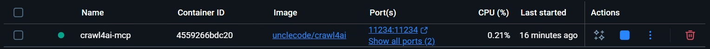

Once docker desktop is setup and the image for crawl 4 ai is pulled run:

```ps
docker run -d `
  --name crawl4ai-mcp `
  -p 11235:11235 `
  unclecode/crawl4ai
```

test:

```ps
curl http://localhost:11235/health
```

the killer:

```ps
docker rm -f crawl4ai-mcp
```

mcp server version:

```ps
docker run -d `
  --name crawl4ai-mcp `
  -p 11235:11235 `
  -p 11234:11234 `
  unclecode/crawl4ai

```
test it
```ps
Invoke-RestMethod http://localhost:11235/
```

need node.js to get mcp server hosted:

```ps
winget install OpenJS.NodeJS.LTS
```

```json
"crawl4ai": {
    "url": "http://localhost:11235/mcp/sse"
}
```
correct setup:


```ps
docker pull unclecode/crawl4ai:latest; docker rm -f crawl4ai-mcp; docker run -d --name crawl4ai-mcp -p 11235:11235 -p 11234:11234 unclecode/crawl4ai:latest
```